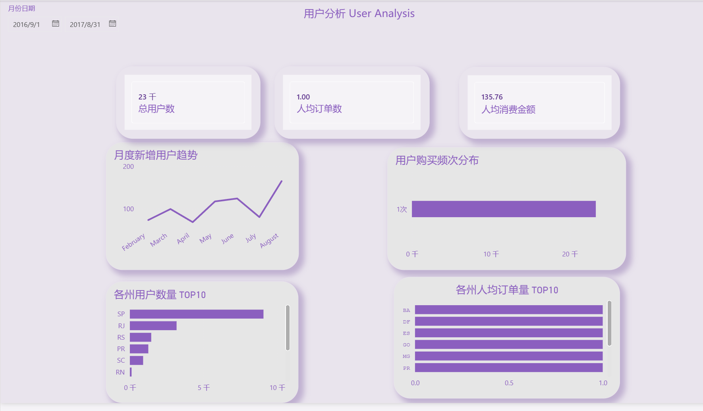
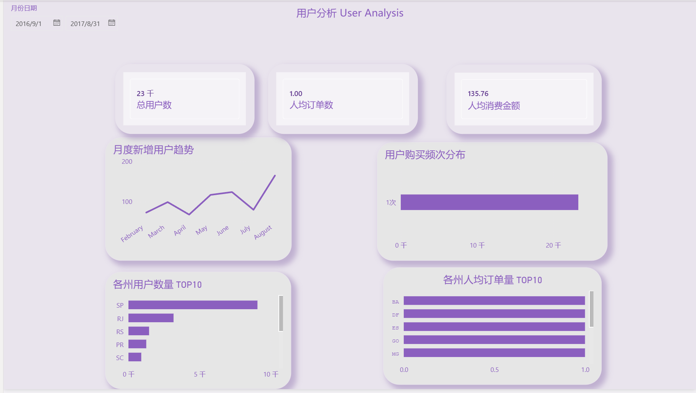
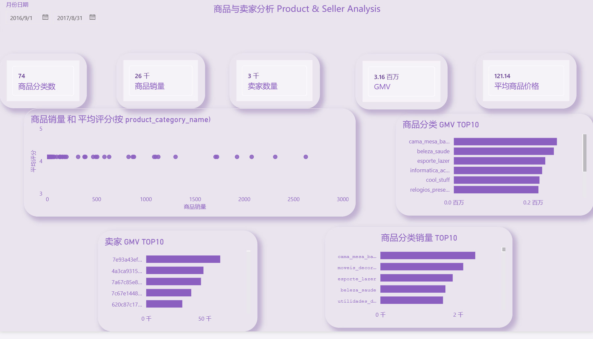
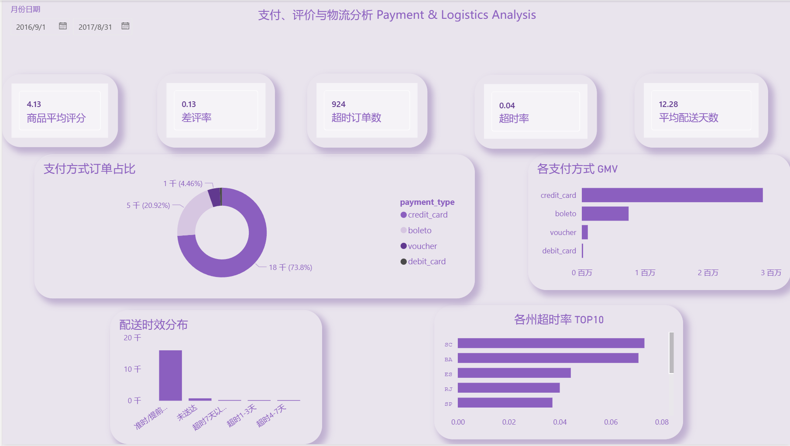

# 电商数据分析实战

基于巴西 Olist 电商平台真实数据集，完成从**数据清洗 → 入库 MySQL → SQL 分析 → PowerBI 可视化**的完整数据分析流程。

## 项目结构

```
ecommerce-data-analysis/
├── data/
│   └── processed/              # 清洗后的数据（CSV）
├── powerbi/                    # PowerBI 仪表板文件
│   ├── Ecommerce_Business_Analysis.pbix   # 业务总览
│   ├── User_Analysis.pbix                 # 用户分析
│   ├── Product_seller_Analysis.pbix       # 商品与卖家分析
│   └── Payment_Logistics_Analysis.pbix    # 支付与物流分析
├── screenshots/                # 仪表板截图
├── sql/                        # SQL 分析脚本
│   ├── check.sql               # 数据库完整性检查
│   ├── order_analysis.sql      # 订单分析
│   ├── order_user_analysis.sql # 用户-订单综合分析
│   ├── retention_analysis.sql  # 用户留存分析
│   ├── product_analysis.sql    # 商品分析
│   ├── seller_analysis.sql     # 卖家分析
│   ├── logistics_analysis.sql  # 物流分析
│   └── customer_payment_review_analysis.sql  # 支付与评价分析
├── src/                        # Python 数据处理脚本
│   ├── data_load.py             # 原始数据加载
│   ├── customers_clean.py       # 客户数据清洗
│   ├── orders_clean.py          # 订单数据清洗
│   ├── order_items_clean.py     # 订单商品清洗
│   ├── order_payments_clean.py  # 支付数据清洗
│   ├── order_reviews_clean.py   # 评价数据清洗
│   ├── products_clean.py        # 商品数据清洗
│   ├── sellers_clean.py         # 卖家数据清洗
│   ├── category_name_clean.py   # 商品分类翻译清洗
│   └── load_mysql.py            # 数据导入 MySQL
├── requirements.txt            # Python 依赖
└── .gitignore
```

## 数据来源

使用 [Brazilian E-Commerce Public Dataset by Olist](https://www.kaggle.com/datasets/olistbr/brazilian-ecommerce)（Kaggle），包含约 10 万条订单数据，涵盖 2016 年 9 月至 2018 年 8 月的交易记录。

主要数据表：

| 表名 | 说明 |
|------|------|
| customers | 客户信息（约 9.6 万） |
| orders | 订单信息（约 9.9 万） |
| order_items | 订单商品明细 |
| order_payments | 订单支付信息 |
| order_reviews | 订单用户评价 |
| products | 商品信息 |
| sellers | 卖家信息 |
| category_name | 商品分类名称翻译（葡萄牙语→英语） |

## 技术栈

- **Python**（pandas, numpy, pymysql, sqlalchemy）— 数据清洗与入库
- **MySQL** — 数据存储与 SQL 分析
- **PowerBI** — 数据可视化仪表板

## 快速开始

### 1. 安装依赖

```bash
pip install -r requirements.txt
```

### 2. 数据准备

从 Kaggle 下载原始数据集，解压至 `data/raw/` 目录（已加入 .gitignore，不会上传到仓库）。

### 3. 数据清洗

运行 `src/` 目录下的各清洗脚本，或汇总运行：

```python
# 在 Python 中依次执行清洗脚本
```

清洗内容包括：时间字段格式转换、缺失值与重复值检查、数据质量预览。

清洗后的数据输出至 `data/processed/`。

### 4. 导入 MySQL

确保本地 MySQL 已创建 `ecommerce` 数据库，修改 `src/load_mysql.py` 中的数据库连接信息后运行：

```bash
python src/load_mysql.py
```

### 5. 执行 SQL 分析

按顺序执行 `sql/` 目录下的分析脚本，先用 `check.sql` 验证数据完整性。

### 6. 查看 PowerBI 仪表板

用 PowerBI Desktop 打开 `powerbi/` 目录下的 `.pbix` 文件。

## 分析内容

### 1. 业务总览

- 总订单量、GMV、整体客单价
- 按月订单量、销售额、客单价趋势

### 2. 用户分析

- 各州订单总量、平均商品价格、平均运费
- 用户下单频次分布
- 每月新增用户趋势
- 用户复购间隔分析
- 月度用户留存分析

### 3. 商品与卖家分析

- 各商品分类成交件数、订单量、GMV 排行
- 各分类商品平均售价与平均运费
- 各分类 TOP-5 热销商品排名
- 商品销量与评分对比
- 卖家销售额排行与梯队分层（头部/腰部/长尾）
- 卖家口碑分析（评分、差评率）

### 4. 支付与物流分析

- 不同地区用户支付方式偏好
- 不同支付方式的用户评分差异
- 配送时效分区统计（准时/超时 1-3 天/4-7 天/7 天以上）
- 各地区订单超时率

## 仪表板预览

| 业务总览 | 用户分析 |
|:---:|:---:|
|  |  |

| 商品与卖家分析 | 支付与物流分析 |
|:---:|:---:|
|  |  |